[](#)


[🍒 Cherry3 ORM](https://www.npmjs.com/package/cherry3)

## 🎚️ Nasıl Kurulur?
- **NodeJS'in Sitesinden NodeJS'i İndirin Ve Yükleyin.  [İndirmek İçin Tıklayın](https://nodejs.org/en)**
- **Botun Klasöründe Yeni Bir CMD (Terminal) Açın.**
- **Gelen Ekrana İlk Olarak ` npm install ` Yazıp Enter Atın.**
- **Sonrasında ` config.js ` Dosyasına Girerek Alttaki Gibi Verileri Doldurun.**
```js

mainToken: "", // Ana Bot Token
channelToken: "", // Kanal Koruma Token
roleToken: "", // Rol Koruma Token
otherToken: "", // Diğer Bot Token

guildID:"", // Sunucu ID
webhookURL: "", // guard-log Webhook URL
commandPermission:["928259219038302258"], // Komut Erişimi

// AntiSpam Koruma
antiSpam:{...},

// Küfür Koruma Kısmı
Curses:[...]
```
- **` config.js `'i Doldurduktan Sonra Önceden Açtığınız CMD (Terminal)'e ` npm run start ` Yazıp Enter Atınız.**
- **Bot Hazır Ve Aktif, Komut Kullanımları İçin Alttaki Resimleri İnceliyebilirsiniz.**
- **Yardım, Kurulum İçin Destek, Hata Bildirimi İçin Alttaki Discord Sunucumuza Gelebilirsiniz.**
  
[](https://discord.gg/luppux)

## 🌟 Proje Hakkında
- Eski Guard Botlarım İşte Tahmini 1-1,5 Sene Önce Kullandığım Botlar Alın Kullanın Luhux Gibi Türeme Orospulara Prim Vermeyin, Buda Ona Son Primim Olsun.

### 🤖 Bot Görselleri
<details>
 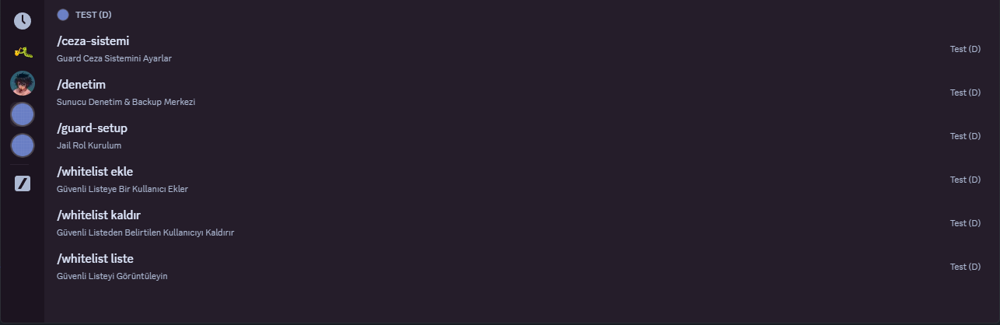
 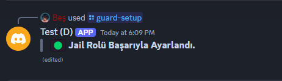
 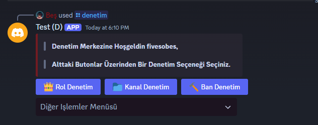
 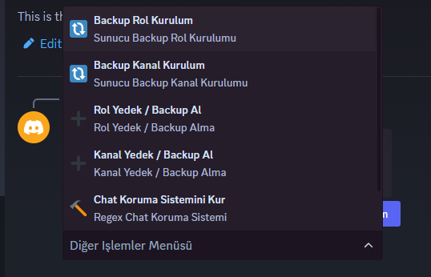
  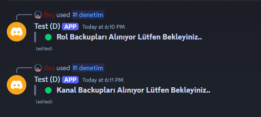
 
  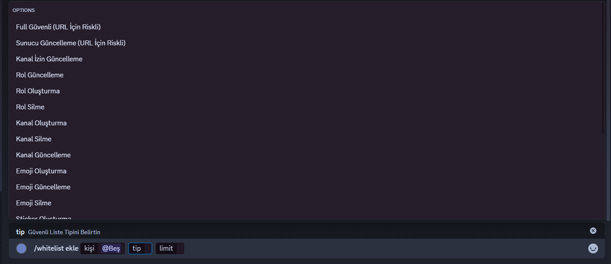
 
  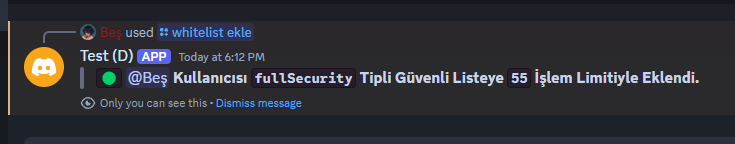
 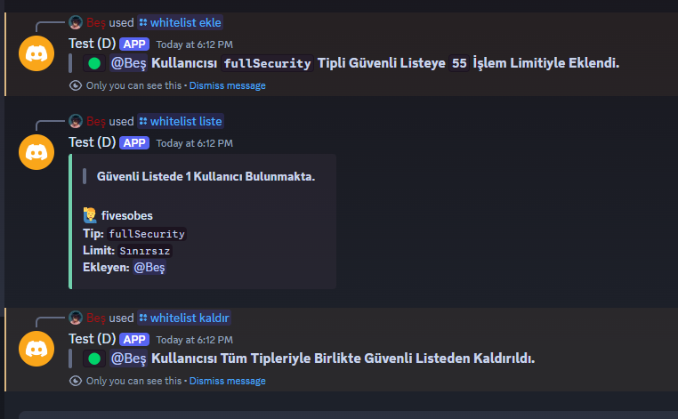
  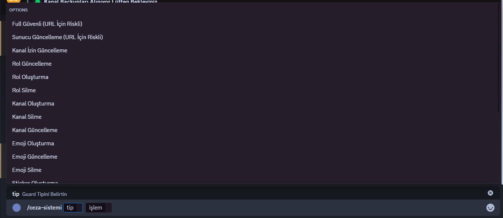
 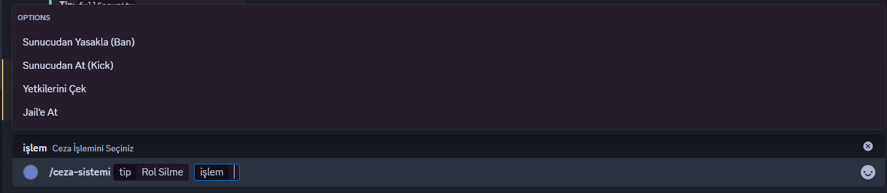
  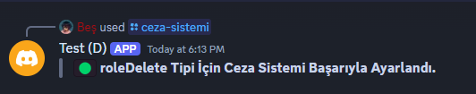
 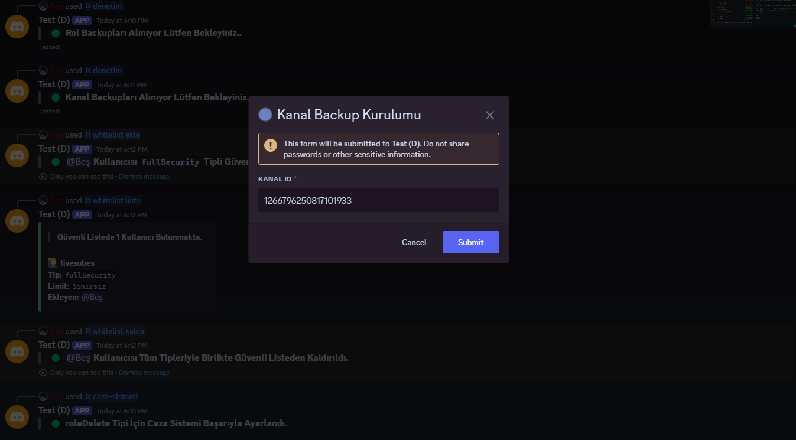
  
 
  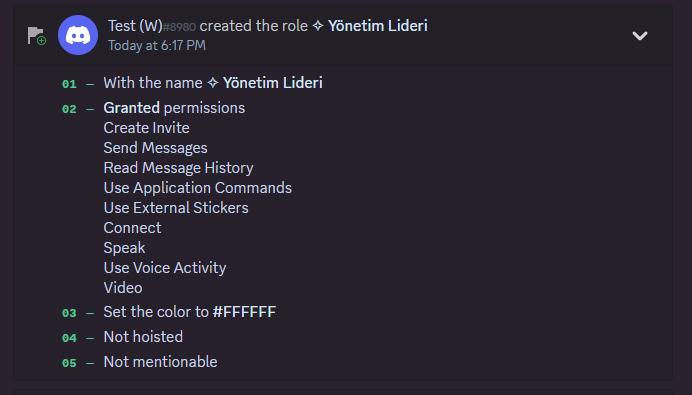
 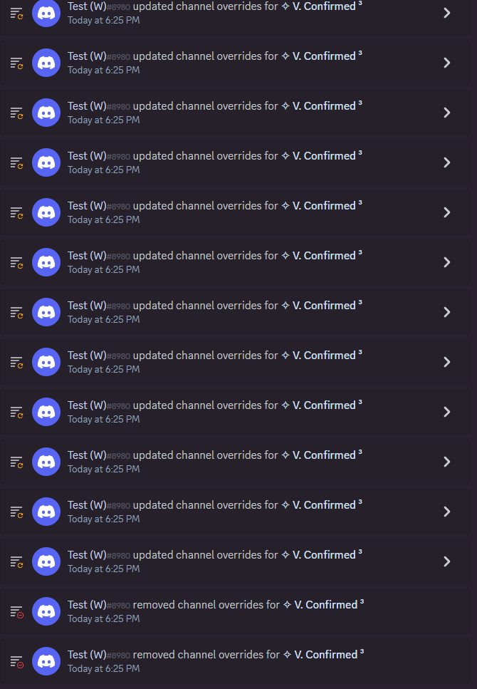
  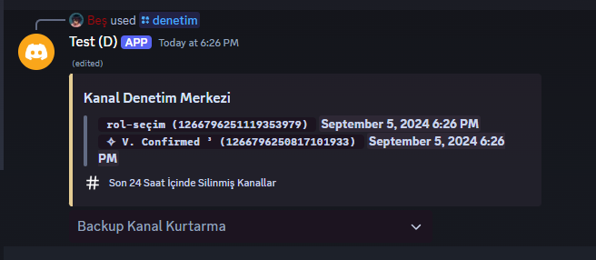
 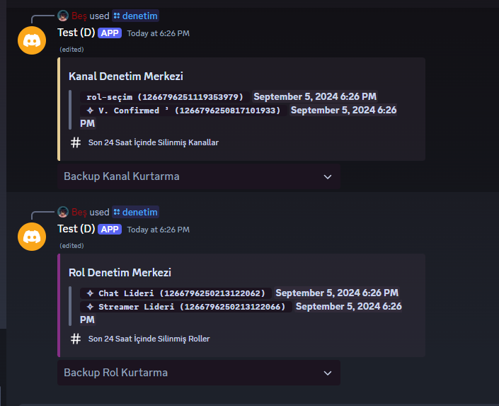
 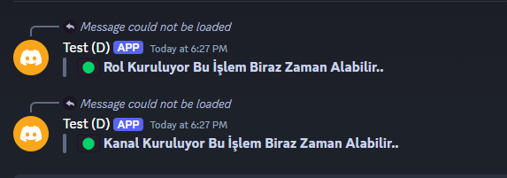
 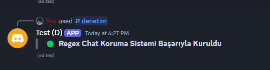
</details>

## 🔵 Discord Profilim
*Ücretli Altyapı, Bot, Kod, Yazılım vb. İçin DM Üzerinden Ulaşabilirsiniz.*


 <a href="https://discord.com/users/928259219038302258"></a>

## 📖 Lisans
[GPL-3.0](https://www.gnu.org/licenses/gpl-3.0.html) - Copyright © 2023 [Bes-js](https://github.com/Bes-js)
